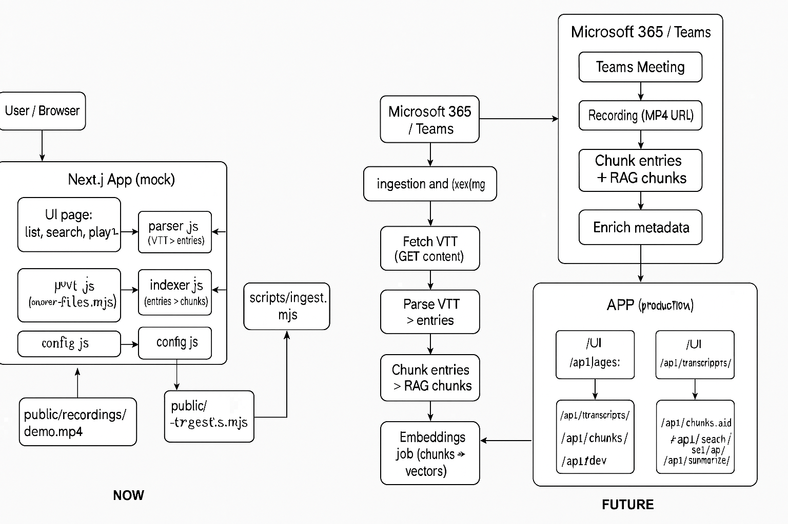

# MeetingAI  🎯

> **Intelligent meeting transcript analysis powered by AI**

A premium Next.js application that transforms Microsoft Teams meeting transcripts into actionable insights. Upload VTT files, chat with your meetings using RAG, extract AI-powered summaries, and automatically identify action items.



---


### 🔧 **Developer-Friendly**
- **File or MongoDB Storage** - Swap backends without code changes
- **REST API** - Well-documented endpoints for all features
- **Mock Data** - Sample meetings included for testing

---

## 🚀 Quick Start

### 1. Install Dependencies
```bash
npm install
```

### 2. Configure Environment
Create a `.env` file (copy from `.env.example`):
```bash
cp .env.example .env
```


### 3. Start Development Server
```bash
npm run dev
```

Server runs on **http://localhost:5656**

### 4. Import Sample Data
Click "Import Samples" in the UI, or use:
```bash
# PowerShell
Invoke-RestMethod -Uri http://localhost:5656/api/import-mock -Method Post

# cURL
curl -X POST http://localhost:5656/api/import-mock
```

---

## 📁 Project Structure

```
kai/
├── app/
│   ├── api/                    # REST API endpoints
│   │   ├── transcripts/        # Meeting CRUD
│   │   ├── chunks/             # RAG chunks
│   │   ├── search/             # Full-text search
│   │   ├── chat/[id]/          # RAG-based Q&A
│   │   ├── summary/[id]/       # AI summaries
│   │   ├── actions/[id]/       # Action item extraction
│   │   ├── upload/             # File upload handler
│   │   └── import-mock/        # Sample data importer
│   ├── globals.css             # Premium design system
│   ├── layout.js               # Root layout
│   └── page.jsx                # Main UI component
├── lib/
│   ├── parser.js               # VTT parser
│   ├── indexer.js              # Chunking algorithm
│   ├── llm-service.js          # Gemini integration
│   ├── backend-adapter.js      # Business logic
│   └── storage-files.js        # Persistence layer
├── public/
│   ├── mock_data/              # Sample VTT files
│   │   ├── sprint-planning-5m.vtt
│   │   ├── business-review-4m.vtt
│   │   └── standup-30m.vtt
│   └── uploads/                # User-uploaded files
└── data/                       # JSON storage (auto-created)
    ├── transcripts.json
    └── chunks.json
```

---

## 🎯 API Endpoints

### Meetings
| Endpoint | Method | Description |
|----------|--------|-------------|
| `/api/transcripts` | GET | List all meetings |
| `/api/transcripts/:id` | GET | Get meeting details |
| `/api/chunks/:id` | GET | Get RAG chunks for meeting |
| `/api/search?q=term` | GET | Search transcripts |

### AI Services
| Endpoint | Method | Description | Requires |
|----------|--------|-------------|----------|
| `/api/chat/:id` | POST | Ask questions about meeting | Gemini API key |
| `/api/summary/:id` | GET | Generate meeting summary | Gemini API key |
| `/api/actions/:id` | GET | Extract action items | Gemini API key |

### Upload & Import
| Endpoint | Method | Description |
|----------|--------|-------------|
| `/api/upload` | POST | Upload VTT or recording file |
| `/api/import-mock` | POST | Import sample meetings |

---

## 🧠 How It Works

### 1. **VTT Parsing**
```
Input VTT → Parser → Entries [speaker, timestamp, text]
```

### 2. **Chunking Strategy**
```
Entries → Indexer → Chunks [90s window, 350 char min, 15s overlap]
```
- **Why 90 seconds?** Balances context with manageability
- **Why overlap?** Prevents information loss at boundaries
- **Why 350 chars?** Ensures semantic coherence for LLMs

### 3. **RAG Pipeline**
```
User Question → Search Chunks → Top 10 Relevant → Gemini → Answer
```

### 4. **Summarization**
```
Meeting Entries → llm → Executive Summary + Key Topics + Decisions
```

### 5. **Action Extraction**
```
Transcript → llm → [Task, Owner, Deadline, Priority, Context]
```

---

---

## 🔧 Configuration

### MongoDB (Optional)
To use MongoDB instead of file storage:
```env
MONGO_URL=mongodb://localhost:27017
MONGO_DB=teams_notes
```

The app automatically detects MongoDB and switches backends.

### Port Configuration
Default port is **5656**. To change:
```json
// package.json
"scripts": {
  "dev": "next dev --port YOUR_PORT"
}
```


### Upload Fails
- **File size limit:** Next.js default is 4MB
- **Supported formats:** `.vtt` files only (recording transcription coming in FUTURE phase)
- **Check browser console** for detailed errors

---

## 🚧 Roadmap (FUTURE Phase)

- [ ] **Microsoft 365 Integration** - Direct Teams connection
- [ ] **Recording Transcription** - MP4/audio to VTT conversion
- [ ] **Vector Search** - Semantic search with embeddings
- [ ] **MongoDB Atlas** - Production-ready database
- [ ] **Speaker Diarization** - Auto-identify speakers
- [ ] **Multi-language Support** - Translate transcripts
- [ ] **Calendar Integration** - Auto-import scheduled meetings
- [ ] **Export Features** - PDF reports, CSV action items

---

## 📊 Sample Meetings

Included VTT files:
1. **Sprint Planning** (5m) - Technical discussion about AI features
2. **Business Review** (4m) - Quarterly metrics and strategic planning
3. **Standup** (30s) - Quick team sync

All samples use realistic MS Teams WebVTT format with proper speaker tags.


